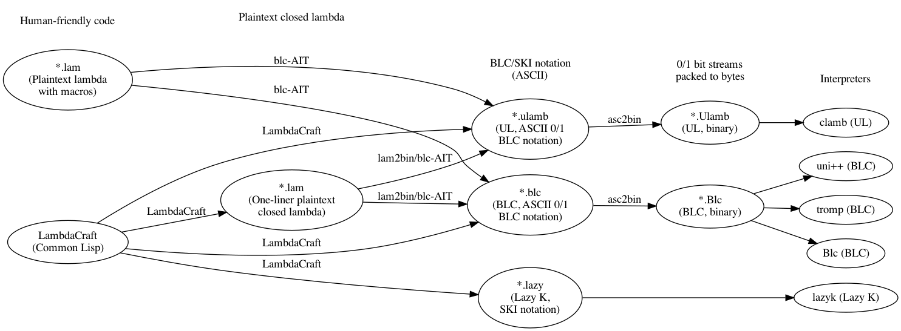

# Lambda Calculus Development Toolkit

This repo is a collection of tools for writing programs in lambda calculus and SKI combinator calculus, written by various authors.


Supported interpreters are:

- SectorLambda, the [521-byte lambda calculus interpreter](https://justine.lol/lambda/) written by Justine Tunney
- The [IOCCC](https://www.ioccc.org/) 2012 ["Most functional"](https://www.ioccc.org/2012/tromp/hint.html) interpreter written by John Tromp
  (the [source](https://www.ioccc.org/2012/tromp/tromp.c) is in the shape of a λ)
- Universal Lambda interpreter [clamb](https://github.com/irori/clamb) and Lazy K interpreter [lazyk](https://github.com/irori/lazyk) written by Kunihiko Sakamoto


## Dependency Graph



## Supported Lambda Calculus Interpreters
Below is a summary of the supported lambda calculus interpreters.
All interpreters run on the terminal and automatically handles the previously described
string-to-lambda encoding for the standard I/O.
Each interpreter uses a slightly different I/O encoding, classified below as languages.

LambdaLisp is written natively as a lambda term based on the language [Binary Lambda Calculus](https://tromp.github.io/cl/cl.html).
It is adapted to other languages by wrapping it with an [encoder-decoder](./src/lazyk-ulamb-blc-wrapper.cl) that absorbs the language spec differences.


| Language                                                     | Extension | Engine                  | Program Format               |
|--------------------------------------------------------------|-----------|-------------------------|------------------------------|
| [Binary Lambda Calculus](https://tromp.github.io/cl/cl.html) | *.blc     | Untyped Lambda Calculus | Binary (asc2bin can be used) |
| [Universal Lambda](http://www.golfscript.com/lam/)           | *.ulamb   | Untyped Lambda Calculus | Binary (asc2bin can be used) |
| [Lazy K](https://tromp.github.io/cl/lazy-k.html)             | *.lazy    | SKI Combinator Calculus | ASCII                        |

| Interpreter                                         | Language               | Platforms    | Build Command | Author                             | Notes                                                                                                                                                                                |
|-----------------------------------------------------|------------------------|--------------|---------------|------------------------------------|--------------------------------------------------------------------------------------------------------------------------------------------------------------------------------------|
| [Blc](https://justine.lol/lambda/)                  | Binary Lambda Calculus | x86-64-Linux | `make blc`    | [@jart](https://github.com/jart)   | [521-byte interpreter](https://justine.lol/lambda/)                                                                                                                                  |
| [tromp](https://www.ioccc.org/2012/tromp/hint.html) | Binary Lambda Calculus | Any          | `make tromp`  | [@tromp](https://github.com/tromp) | [IOCCC](https://www.ioccc.org/) 2012 ["Most functional"](https://www.ioccc.org/2012/tromp/hint.html) - the [source](https://www.ioccc.org/2012/tromp/tromp.c) is in the shape of a λ |
| [uni](https://tromp.github.io/cl/cl.html)           | Binary Lambda Calculus | Any          | `make uni`    | [@tromp](https://github.com/tromp) | Unobfuscated version of `tromp`                                                                                                                                                      |
| [clamb](https://github.com/irori/clamb)             | Universal Lambda       | Any          | `make clamb`  | [@irori](https://github.com/irori) | Fast UL interpreter                                                                                                                                                                  |
| [lazyk](https://github.com/irori/lazyk)             | Lazy K                 | Any          | `make lazyk`  | [@irori](https://github.com/irori) | Fast Lazy K interpreter                                                                                                                                                              |

### Building the Lambda Calculus Interpreters
Several notes about the interpreters:

- The BLC intepreter `Blc` runs only on x86-64-Linux systems.
- The BLC interpreter `tromp` may not compile on a Mac with the defualt gcc (which is actually an alias of clang). Details are provided below.
- The most reliably compilable BLC interpreter is `uni`, which compiles and runs on both Linux and Mac.
- The interpreters for Universal Lambda and Lazy K, `clamb` and `lazyk`, can be built and run on both of these systems.

To build all interpreters:

```sh
make interpreters
```

Or, to build them individually:
```sh
make blc tromp uni clamb lazyk asc2bin
```

Here, asc2bin is a utility that packs ASCII 0/1 bitstreams to a byte stream, the format accepted by the BLC and UL interpreters.

The interpreters' source codes are obtained from external locations.
When the make recipe is run, each recipe obtains these external source codes using the following commands:

- `blc`:
  - `Blc.S`: `wget https://justine.lol/lambda/Blc.S?v=2`
  - `flat.lds`: `wget https://justine.lol/lambda/flat.lds`
- `uni`: `wget https://tromp.github.io/cl/uni.c`
- `tromp`: `wget http://www.ioccc.org/2012/tromp/tromp.c`
- `clamb`: `git clone https://github.com/irori/clamb`
- `lazyk`: `git clone https://github.com/irori/lazyk`


